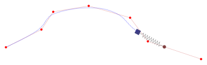

# Ink Stroke Modeler

[](https://github.com/google/ink-stroke-modeler/actions/workflows/bazel-test.yaml)
[](https://github.com/google/ink-stroke-modeler/actions/workflows/cmake-test.yaml)

This library smooths raw freehand input and predicts the input's motion to
minimize display latency. It turns noisy pointer input from touch/stylus/etc.
into the beautiful stroke patterns of brushes/markers/pens/etc.

Be advised that this library was designed to model handwriting, and as such,
prioritizes smooth, good-looking curves over precise recreation of the input.

This library is designed to have minimal dependencies; the library itself relies
only on the C++ Standard Library and [Abseil](https://abseil.io/), and the tests
use the [GoogleTest](https://google.github.io/googletest/) framework.

## Build System

### Bazel

Ink Stroke Modeler can be built and the tests run from the GitHub repo root
with:

```shell
bazel test ...
```

To use Ink Stroke Modeler in another Bazel project, put the following in the
`MODULE.bazel` file to download the code from GitHub head and set up
dependencies:

```bazel
git_repository = use_repo_rule("@bazel_tools//tools/build_defs/repo:git.bzl", "git_repository")

git_repository(
    name = "ink_stroke_modeler",
    remote = "https://github.com/google/ink-stroke-modeler.git",
    branch = "main",
)
```

If you want to depend on a specific version, you can specify a commit in
[`git_repository`](https://bazel.build/rules/lib/repo/git#git_repository)
instead of a branch. Or if you want to use a local checkout of Ink Stroke
Modeler instead, use the
[`local_repository`](https://bazel.build/reference/be/workspace#local_repository)
workspace rule instead of `git_repository`.

Since Ink Stroke Modeler requires C++20, it must be built with
`--cxxopt='-std=c++20'` (or similar indicating a newer version). You can put the
following in your project's `.bazelrc` to use this by default:

```none
build --cxxopt='-std=c++20'
```

Then you can include the following in your targets' `deps`:

*   `@ink_stroke_modeler//ink_stroke_modeler:stroke_modeler`:
    [`ink_stroke_modeler/stroke_modeler.h`](ink_stroke_modeler/stroke_modeler.h)
*   `@ink_stroke_modeler//ink_stroke_modeler:types`:
    [`ink_stroke_modeler/types.h`](ink_stroke_modeler/types.h)
*   `@ink_stroke_modeler//ink_stroke_modeler:params`:
    [`ink_stroke_modeler/types.h`](ink_stroke_modeler/params.h)

### CMake

Ink Stroke Modeler can be built and the tests run from the GitHub repo root
with:

```shell
cmake .
cmake --build .
ctest
```

To use Ink Stroke Modeler in another CMake project, you can add the project as a
submodule:

```shell
git submodule add https://github.com/google/ink-stroke-modeler
```

And then include it in your `CMakeLists.txt`, requiring at least C++20:

```cmake
set(CMAKE_CXX_STANDARD 20)
set(CMAKE_CXX_STANDARD_REQUIRED ON)
# If you want to use installed (or already fetched) versions of Abseil and/or
# GTest (for example, if you've installed libabsl-dev and libgtest-dev), add:
# set(INK_STROKE_MODELER_FIND_ABSL ON)
# set(INK_STROKE_MODELER_FIND_GTEST ON)
add_subdirectory(ink-stroke-modeler)
```

Then you can depend on the following with `target_link_libraries`:

*   `InkStrokeModeler::stroke_modeler`: `ink_stroke_modeler/stroke_modeler.h`
*   `InkStrokeModeler::types`: `ink_stroke_modeler/types.h`
*   `InkStrokeModeler::params`: `ink_stroke_modeler/types.h`

CMake does not have a mechanism for enforcing target visibility, but consumers
should depend only on the non-test top-level targets defined in
`ink_stroke_modeler/CMakeLists.txt`.

The CMake build uses the abstractions defined in
`cmake/InkBazelEquivalents.cmake` to structure targets in a way that's similar
to the Bazel BUILD files to make it easier to keep those in sync. The main
difference is that CMake has a flat structure for target names, e.g.
`@com_google_absl//absl/status:statusor` in Bazel is `absl::statusor` in CMake.
This means that targets need to be given unique names within the entire project
in CMake.

### CMake Install

Ink Stroke Modeler is intended to be built into consumers from source. But
sometimes a packaged version is needed, for example to integrate with other
build systems that wrap CMake. To test the packaging and export of Ink Stroke
Modeler targets, you can install the dependencies with something like:

```shell
sudo apt install libabsl-dev googletest
```

And then run:

```shell
cmake -DINK_STROKE_MODELER_FIND_DEPENDENCIES=ON \
    -DCMAKE_INSTALL_PREFIX=$HOME/cmake .
make install
```

Or to build fetched dependencies from source instead of using installed ones:

```shell
cmake -DCMAKE_INSTALL_PREFIX=$HOME/cmake .
make install
```

Set `CMAKE_INSTALL_PREFIX` to point the install somewhere other than system
library paths.

## Usage

The Ink Stroke Modeler API is in the namespace `ink::stroke_model`. The primary
surface of the API is the `StrokeModeler` class, found in `stroke_modeler.h`.
You'll also simple data types and operators in `types.h`, and the parameters
which determine the behavior of the model in `params.h`.

To begin, you'll need choose parameters for the model (the parameters for your
use case may vary; see `params.h`), instantiate a `StrokeModeler`, and set the
parameters via `StrokeModeler::Reset()`:

```c++
StrokeModelParams params{
    .wobble_smoother_params{
        .timeout{.04}, .speed_floor = 1.31, .speed_ceiling = 1.44},
    .position_modeler_params{.spring_mass_constant = 11.f / 32400,
                             .drag_constant = 72.f},
    .sampling_params{.min_output_rate = 180,
                     .end_of_stroke_stopping_distance = .001,
                     .end_of_stroke_max_iterations = 20},
    .stylus_state_modeler_params{.max_input_samples = 20},
    .prediction_params = StrokeEndPredictorParams()};

StrokeModeler modeler;
if (absl::Status status = modeler.Reset(params); !status.ok()) {
  // Handle error.
}
```

You may also call `Reset()` on an already-initialized `StrokeModeler` to set new
parameters; this also clears the in-progress stroke, if any. If the `Update` or
`Predict` functions are called before `Reset`, they will return
`absl::FailedPreconditionError`.

To use the model, pass in an `Input` object to `StrokeModeler::Update()` each
time you receive an input event. This appends to a `std::vector<Result>` of
stroke smoothing results:

```c++
Input input{
  .event_type = Input::EventType::kDown,
  .position{2, 3},  // x, y coordinates in some consistent units
  .time{.2},  // Time in some consistent units
  // The following fields are optional:
  .pressure = .2,  //  Pressure from 0 to 1
  .orientation = M_PI  // Angle in plane of screen in radians
  .tilt = 0,  // Angle elevated from plane of screen in radians
};
if (absl::Status status = modeler.Update(input, smoothed_stroke);
    !status.ok()) {
  // Handle error...
  return status;
}
// Do something with the smoothed stroke so far...
return absl::OkStatus();
```

`Input`s are expected to come in a *stream*, starting with a `kDown` event,
followed by zero or more `kMove` events, and ending with a `kUp` event. If the
modeler is given out-of-order inputs or duplicate inputs, it will return
`absl::InvalidArgumentError`. `Input.time` may not be before the `time` of the
previous input.

`Input`s are expected to come from a single stroke produced with an input
device. Extraneous inputs, like touches with the palm of the hand in
touch-screen stylus input, should be filtered before passing the correct input
events to `Update`. If the input device allows for multiple strokes at once (for
example, drawing with two fingers simultaneously), the inputs for each stroke
must be passed to separate `StrokeModeler` instances.

The `time` values of the returned `Result` objects start at the `time` of the
first input and end either at the time of the last `Input` (for in-progress
strokes) or a hair after (for completed ones). The position of the first
`Result` exactly matches the position of the first `Input` and the `position` of
the last `Result` attempts to very closely match the match the `position` of the
last `Input`, wile the `Result` objects in the middle have their `position`
adjusted to smooth out and interpolate between the input values.

To construct a prediction, call `StrokeModeler::Predict()` while an input stream
is in-progress. This takes a `std::vector<Result>` and replaces the contents
with the new prediction:

```c++
if (absl::Status status = modeler.Predict(predicted_stroke); !status.ok) {
  // Handle error...
  return status;
}
// Do something with the new prediction...
return absl::OkStatus();
```

If no input stream is in-progress, it will instead return
`absl::FailedPreconditionError`.

When the model is configured with `StrokeEndPredictorParams`, the last `Result`
returned by `Predict` will have a `time` slightly after the most recent `Input`.
(This is the same as the points that would be added to the `Result`s returned by
`Update` if the most recent input was `kUp` instead of `kMove`.) When the model
is configured with `KalmanPredictorParams`, the prediction may take more time to
"catch up" with the position of the last input, then take an additional interval
to extend the stroke beyond that position.

The state of the most recent stroke can be represented by concatenating the
vectors of `Result`s returned by a series of successful calls to `Update`,
starting with the most recent `kDown` event. If the input stream does not end
with a `kUp` event, you can optionally append the vector of `Result`s returned
by the most recent call to `Predict`.

## Implementation Details

<p class="hidden-in-github-pages">(<em>Note:</em> Mathematical formulas below
are rendered with <a href="https://www.mathjax.org/">MathJax</a>, which GitHub's
native Markdown rendering does not support. You can view the rendered version
<a href="https://google.github.io/ink-stroke-modeler/#implementation-details">on
GitHub pages</a>.)</p>

The design goals for this library were:

*   Minimize overall latency.
*   Accurate reproduction of intent for drawing and handwriting (preservation of
    inflection points).
*   Smooth digitizer noise (high frequency).
*   Smooth human created noise (low and high frequency). For example:
    *   For most people, drawing with direct mouse input is very accurate, but
        looks bad.
    *   For most people, drawing with a real pen looks bad. We should capture
        some of the differences between professional and amateur pen control.

At a high level, we start with an assumption that all reported input events are
estimates (from both the person and hardware). We keep track of an idealized pen
constrained by a physical model of motion (mass, friction, etc.) and feed these
position estimates into this idealized pen. This model lags behind reported
events, as with most smoothing algorithms, but because we have the modeled
representation we can sample its location at arbitrary and even future times.
Using this, we predict forward from the delayed model to estimate where we will
go. The actual implementation is fairly simple: a fixed timestep Euler
integration to update the model, in which input events are treated as spring
forces on that model.

Like many real-time smoothing algorithms, the stroke modeler lags behind the raw
input. To compensate for this, the stroke modeler has the capability to predict
the upcoming points, which are used to "catch up" to the raw input.

### The Model

Typically, we expect the stroke modeler to receive raw inputs in real-time; for
each input it receives, it produces one or more modeled results.

When asked for a prediction, the stroke modeler computes it based on its current
state -- this means that the prediction is invalid as soon as the next input is
received.

> NOTE: The definitions and algorithms in this document are defined as though
> the input streams are given as a complete set of data, even though the engine
> actually receives raw inputs one by one. It's written this way for ease of
> understanding.
>
> However, one of the features of these algorithms is that any result that has
> been constructed will remain the same even if more inputs are added, i.e. if
> we view the algorithm as a function $$F$$ that maps from an input stream to a
> set of results, then $$F(\{i_0, \ldots, i_j\}) \subseteq F(\{i_0, \ldots, i_j,
> i_{j + 1}\})$$. Applying the algorithm in real-time is then effectively the
> same as evaluating the function on increasingly large subsets of the input
> stream, i.e. $$F(\{i_0\}), F(\{i_0, i_1\}), F(\{i_0, i_1, i_2\}), \ldots$$

##### Math Stuff

**Definition**: We define the *pressure* $$\sigma$$ as the amount of force which
is applied to the writing surface with the stylus, as reported by the platform.
We expect $$\sigma \in [0, 1]$$ for devices that report pressure, with 0 and 1
representing the minimum and maximum detectable pressure, or $$\sigma =
\emptyset$$ if the device does not report pressure. $$\square$$

**Definition**: We define the *tilt* $$\theta$$ as the angle between the stylus,
and a vector perpendicular to the writing surface. We expect $$\theta \in [0,
\frac{\pi}{2}]$$. $$\square$$

**Definition:** We define the *orientation* $$\phi$$ as the counter-clockwise
angle between the projection of the stylus onto the writing surface, and the
writing surface's x-axis. We expect $$\phi \in [0, 2 \pi)$$. $$\square$$

NOTE: In the code, we use a sentinel value of -1 to represent unreported
pressure, tilt, or orientation.

**Definition:** A *raw input* is a `struct` $$\{p, t, \sigma, \theta, \phi\}$$,
where $$p$$ is a `Vec2` position, $$t$$ is a `Time`, $$\sigma$$ is a `float`
representing the pressure, $$\theta$$ is a `float` representing tilt, and
$$\phi$$ is a `float` representing orientation. For any raw input $$i$$, we
denote its position, time, pressure, tilt, and orientation as $$i^p$$, $$i^t$$,
$$i^\sigma$$, $$i^\theta$$, and $$i^\phi$$ respectively. $$\square$$

**Definition:** An *input stream* is a finite sequence of raw inputs, ordered by
time strictly non-decreasing, such that the first raw input is the `kDown`, and
each subsequent raw input is a `kMove`, with the exception of the final one,
which may alternatively be the `kUp`. Additionally, we say that a *complete
input stream* is a one such that the final raw input is the `kUp`. $$\square$$

**Definition:** A *tip state* is a `struct` $$\{p, v, t\}$$, where $$p$$ a
`Vec2` position, $$v$$ is a `Vec2` velocity, and $$t$$ is a `Time`. Similarly to
raw input, for a tip state $$q$$, we denote its position, velocity, and time as
$$q^p$$, $$q^v$$, and $$q^t$$, respectively. $$\square$$

**Definition:** A *stylus state* is a `struct` $$\{\sigma, \theta, \phi\}$$,
where $$\sigma$$ is a `float` representing the pressure, $$\theta$$ is a `float`
representing tilt, and $$\phi$$ is a `float` representing orientation. As above,
for a stylus state $$s$$, we denote its pressure, tilt, and orientation as
$$s^\sigma$$, $$s^\theta$$, and $$s^\phi$$ respectively. $$\square$$

**Definition:** We define the *rounding function* $$R$$ such that $$R(x) =
\begin{cases} \lfloor x \rfloor, & x - \lfloor x \rfloor \leq \frac{1}{2} \\
\lceil x \rceil & o.w. \end{cases}$$. $$\square$$

**Definition:** We define the *linear interpolation function* $$L$$ such that
$$L(a, b, \lambda) = a + \lambda (b - a)$$. $$\square$$

**Definition:** We define the *normalization function* $$N$$ such that $$N(a, b,
\lambda) = \frac{\lambda - a}{b - a}$$. $$\square$$

**Definition:** We define the *clamp function* $$C$$ such that $$C(a, b,
\lambda) = \max(a, \min(b, \lambda))$$. $$\square$$

#### Wobble Smoothing

The positions of the raw input tend to have some noise, due to discretization on
the digitizer or simply an unsteady hand. This noise produces wobbles in the
model and prediction, especially at slow speeds.

To reduce high-frequency noise, we take a time-variant moving average of the
position instead of the position itself -- this serves as a low-pass filter.
This, however, introduces some lag between the raw input position and the
filtered position. To compensate for that, we use a linearly-interpolated value
between the filtered and raw position, based on the moving average of the
velocity of the input.

##### Math Stuff

**Algorithm #1:** Given an input stream $$\{i_0, i_1, \ldots, i_n\}$$, a
duration $$\Delta$$ over which to take the moving average, and minimum and
maximum velocities $$v_{min}$$ and $$v_{max}$$ we construct the noise-filtered
input stream $$\{i_0', i_1', \ldots, i_n'\}$$ as follows:

> NOTE: The values of $$\Delta$$, $$v_{min}$$, and $$v_{max}$$ are taken from
> `WobbleSmootherParams`:
>
> *   $$\Delta$$ = `timeout`
> *   $$v_{min}$$ = `speed_floor`
> *   $$v_{max}$$ = `speed_ceiling`

For each raw input $$i_j$$, we can then find the set of raw inputs that occurred
within the previous duration $$\Delta$$:

$$I_j^{<\Delta} = \left\{i_k \middle| i_j^t - i_k^t \in [0, \Delta]\right\}$$

We then calculate the moving averages of position $$\overline p_j$$ and velocity
$$\overline v_j$$:

$$\begin{align*}
\overline p_j & = \begin{cases}
i_j^p, & j = 0 \vee j = n \\
\frac{1}{\|I_j^{<\Delta}\|} \sum\limits_k i_k^p
\left[i_k \in I_j^{<\Delta} \right],
& \mathrm{o.w.} \end{cases} \\
\overline v_j & = \begin{cases}
0, & j = 0 \\
\frac{1}{\|I_j^{<\Delta}\|} \sum\limits_k \frac{\|i_k^p - i_{k - 1}^p\|}
{i_k^t - i_{k - 1}^t} \left[i_k \in I_j^{<\Delta} \right],
& \mathrm{o.w.}
\end{cases}
\end{align*}$$

NOTE: In the above equations, the square braces denote the
[Iverson bracket](https://en.wikipedia.org/wiki/Iverson_bracket).

We then normalize $$\overline v_j$$ between $$v_{min}$$ and $$v_{max}$$, and
find the filtered position $$p'_j$$ by linearly interpolating between $$i_j^p$$
and $$\overline p_j$$:

$$\begin{align*}
\lambda_j & = \begin{cases}
0, & \overline v_j < v_0 \\
1, & \overline v_j > v_1 \\
N(v_{min}, v_{max}, v_j), & \mathrm{o.w.}
\end{cases} \\
p'_j & = L\left(\overline p_j, i_j^p, \lambda_j\right)
\end{align*}$$

Finally, we construct raw input $$i'_j = \left\{p'_j, i_j^t, i_j^\sigma\right\}.
\square$$

### Resampling

Input packets may come in at a variety of rates, depending on the platform and
input device. Before performing position modeling, we upsample the input to some
minimum rate.

##### Math Stuff

**Algorithm #2:** Given an input stream $$I = \{i_0, i_1, \ldots, i_n\}$$, and a
maximum time between inputs $$\Delta_{max}$$, we construct the upsampled input
stream $$U \supseteq I$$ as follows:

NOTE: The value of $$\Delta_{target}$$ is `1 / SamplingParams::min_output_rate`.

We construct a sequence $$\{a_1, a_2, \ldots, a_n\}$$ such that $$a_j = \left
\lceil \frac{i_j^t - i_{j - 1}^t}{\Delta_{target}} \right \rceil$$, representing
the required number of interpolations between each pair of raw inputs.

We then construct a sequence of sequences $$\{u_1, u_2, \ldots, u_n\}$$ such
that $$u_j = \{L(i_{j - 1}, i_j, \frac{k}{a_j} \, | \, k = 1, 2, \ldots,
a_j\}$$. Finally, we construct the upsampled input stream by concatenation:
$$U = \{i_0, u_1, u_2, \ldots, u_n\}$$. $$\square$$

### Position Modeling

The position of the pen is modeled as a weight connected by a spring to an
anchor. The anchor moves along the resampled raw inputs, pulling the weight
along with it across a surface, with some amount of friction. We then use Euler
integration to solve for the position of the pen.

NOTE: For simplicity, we say that the spring has a relaxed length of zero, and
that the anchor is unafected by outside forces such as friction or the drag from
the pen.

{height="200"}

##### Math Stuff

**Lemma:** We can model the position of the pen with the following ordinary
differential equation:

$$\frac{d^2s}{dt^2} = \frac{k_s}{m_{pen}}(\Phi(t) - s(t)) - k_d \frac{ds}{dt}$$

where $$t$$ is the time, $$s(t)$$ is the position of the pen, $$\Phi(t)$$ is the
position of the anchor, $$m_{pen}$$ is a the mass of the pen, $$k_s$$ is the
spring constant, and $$k_d$$ is the drag constant.

**Proof:** From the positions of the pen and the anchor, we can use Hooke's Law
to find the force exerted by the spring:

$$F = k_s (\Phi(t) - s(t))$$

Combining the above with Newton's Second Law of Motion, we can then find the
acceleration of the pen $$a(t)$$:

$$F = m_{pen} \cdot a(t) \\
a(t) = \frac{k_s}{m_{pen}}(\Phi(t) - s(t))$$

We also apply a drag to the pen, applying an acceleration of $$-k_dv(t)$$, where
$$v(t)$$ is the velocity of the pen. This gives us:

$$a(t) = \frac{k_s}{m_{pen}}(\Phi(t) - s(t)) - k_dv(t)$$

NOTE: This isn't exactly how you would calculate friction of an object being
dragged across a surface. However, if you assume that $$m_{pen} = 1$$, then it
matches the form of the equation for a sphere moving through a viscous fluid.
See [Kinetic Friction](https://en.wikipedia.org/wiki/Friction#Kinetic_friction)
and [Stokes' Law](https://en.wikipedia.org/wiki/Stokes%27_law).

From the equations of motion, we know that $$v(t) = \frac{ds}{dt}$$ and $$a(t) =
\frac{dv}{dt} = \frac{d^2s}{dt^2}$$. By substitution, we arrive at the ordinary
differential equation stated above. $$\square$$

**Algorithm #3:** Given an incomplete input stream $$\{i_0, i_1, \ldots,
i_n\}$$, initial position $$s_0$$, and initial velocity $$v_0$$, we construct
tip states $$\{q_0, q_1, \ldots\}$$ as follows:

NOTE: When modeling a stroke, we choose $$s_0 = i_0^p$$ and $$v_0 = 0$$, such
that pen is at stationary at the first raw input point. The `StrokeEndPredictor`
also makes use of this algorithm with different initial values, however.

We define the function $$\Phi$$ such that $$\forall j, \Phi(i_j^t) = i_j^p$$.
From above, we know that we can model the position $$s(t)$$ with an ordinary
differential equation:

$$\frac{d^2s}{dt^2} = \frac{k_s}{m_{pen}}(\Phi(t) - s(t)) - k_d \frac{ds}{dt}$$

Because the spring constant and mass are so closely coupled in our model, we
combine them into a single "shape mass" constant $$M = \frac{m_{pen}}{k_s}$$,
giving us:

$$\frac{d^2s}{dt^2} = \frac{\Phi(t) - s(t)}{M} - k_d \frac{ds}{dt}$$

NOTE: The values of $$M$$ and $$k_d$$ are
`PositionModelerParams::spring_mass_constant` and
`PositionModelerParams::drag_constant`, respectively.

We define $$s_j = s(i_j^t)$$, $$v_j = \frac{ds}{dt}(i_j^t)$$, and $$a_j =
\frac{d^2s}{dt^2}(i_j^t)$$, and use the given $$s_0$$ and $$v_0$$. Recalling
that $$\Phi(i_j^t) = i_j^p$$, we can iteratively construct the each following
position:

$$\begin{align*}
\Delta_j & = i_j^t - i_{j - 1}^t \\
a_j & = \frac{i_j^p - s_{j - 1}}{M} - k_d v_{j - 1} \\
v_j & = v_{j - 1} + \Delta_j a_j \\
s_j & = s_{j - 1} + \Delta_j v_j
\end{align*}$$

Finally, we construct tip state $$q_j = \{s_j, i_j^t, v_j\}.\square$$

#### Stroke End

The position modeling algorithm, like many real-time smoothing algorithms, tends
to trail behind the raw inputs by some distance. At the end of the stroke, we
iterate on the position modeling algorithm a few additional times, using the
final raw input position as the anchor, to allow the stroke to "catch up."

##### Math Stuff

**Algorithm #4:** Given the final anchor position $$\omega$$, the final tip
state $$q_{final}$$, the maximum number $$K_{max}$$ of end-of-stroke tip states
to create, the initial time between tip states $$\Delta_{initial}$$, and a
stopping distance $$d_{stop}$$, we construct the next tip state $$q_{next}$$ as
follows:

> NOTE: The values of $$\Delta_{initial}$$, $$K_{max}$$, and $$d_{stop}$$ are
> taken from `SamplingParams`:
>
> *   $$\Delta_{initial}$$ = `min_output_rate`
> *   $$K_{max}$$ = `end_of_stroke_max_iterations`
> *   $$d_{stop}$$ = `end_of_stroke_stopping_distance`

Let $$\Delta_{next} = \Delta_{initial}$$. Using the update equations from
**algorithm #3**, we construct a candidate tip state $$q_c$$:

$$\begin{align*}
a & = \frac{\omega - q_{final}^p}{M} - k_d q_{final}^v \\
v & = q_{final}^v + \Delta_{next} a \\
s & = q_{final}^p + \Delta_{next} v \\
q_c & = \{s, q_{final}^t + \Delta_{next}, v\}
\end{align*}$$

If the distance traveled $$\|q_c - q_{final}\|$$ is less than $$d_{stop}$$, we
discard the candidate, stop iterating, and declare the stroke complete. Further
iterations are unlikely to yield any significant progress.

We then construct the segment $$S$$ connecting $$q_{final}^p$$ and $$q_c^p$$,
and find the point $$S_\omega$$ on $$S$$ nearest to $$\omega$$. If $$S_\omega
\neq q_c^p$$, it means that the candidate has overshot the anchor. We discard
the candidate, and find a new candidate using a smaller timestep, setting
$$\Delta_{next}$$ to one half its previous value. This is repeated until either
we find a candidate that does not overshoot the anchor, or the minimum distance
traveled check fails.

Once we have found a suitable candidate, we let $$q_{next} = q_c$$.

If the remaining distance $$\|\omega - q_{next}^p\|$$ is greater than
$$d_{stop}$$ and the total number of iterations performed, including discarded
candidates, is not greater than $$K_{max}$$, we use this same process to
construct an additional tip state for the end-of-stroke, substituting
$$q_{next}$$ and $$\Delta_{next}$$ for $$q_{final}$$ and $$\Delta_{initial}$$,
respectively. $$\square$$

### Prediction

As mentioned above, the position modeling algorithm tends to trail behind the
raw inputs. In addition to correcting for this at the end-of-stroke, we
construct a set of predicted tip states every frame to present the illusion of
lower latency.

The are two predictors: the `StrokeEndPredictor` (found in
`internal/prediction/stroke_end_predictor.h`) uses a slight variation of the
end-of-stroke algorithm, and the `KalmanPredictor` (found in
`internal/prediction/kalman_predictor.h`) uses a Kalman filter to estimate the
current state of the pen tip and construct a cubic prediction.

Regardless of the strategy used, the predictor is fed each position and
timestamp of raw input as it is received by the model. The model's most recent
tip state is given to the predictor when the predicted tip states are
constructed.

#### Stroke End Predictor

The `StrokeEndPredictor` constructs a prediction using **algorithm #4** to model
what the stroke would be if the last raw input had been a `kUp`, letting
$$\omega$$ be the most recent tip state, and $$q_{final}$$ be the last raw
input.

#### Kalman Predictor

The `KalmanPredictor` uses a pair of
[Kalman filters](https://en.wikipedia.org/wiki/Kalman_filter), one each for the
x- and y-components, to estimate the current state of the pen from the given
inputs.

The Kalman filter implementation operates on the assumption that all states have
one unit of time between them; because of this, we need to rescale the
estimation to account for the actual input and output rates. Additionally, our
experiments suggest that linear predictions look and feel better than non-linear
ones; as such, we also provide weight factors that may be used to reduce the
effect of the acceleration and jerk coefficients on the estimate and prediction.

Once we have the estimated state, we construct the prediction in two parts, each
of which is a sequence of tip states described by a cubic polynomial curve. The
first smoothly connects the last tip state to the estimate state, and the second
projects where the expected position of the pen is in the future.

##### Math Stuff

**Algorithm #5**: Given a process noise factor $$\epsilon_p$$ and measurement
noise factor $$\epsilon_m$$, we construct the Kalman filter as follows:

The difference in time between states, $$\Delta_t$$, is always assumed to be
equal to 1.

The *state transition model* is derived from the equations of motion: given
$$s$$ = position, $$v$$ = velocity, $$a$$ = acceleration, and $$j$$ = jerk, we
can find the new values $$s'$$, $$v'$$, $$a'$$, and $$j'$$:

$$\begin{align*}
s' & = s + v \Delta_t + \frac{a \Delta_t^2}{2} + \frac{j \Delta_t^3}{6} \\
v' & = v + a \Delta_t + \frac{j \Delta_t^2}{2} \\
a' & = a + j \Delta_t \\
j' & = j \\
\end{align*}$$

The *process noise covariance* is modeled as noisy force; from the equations of
motion, we can say that the impact of that noise on each state is equal to:

$$\epsilon_p
\begin{bmatrix}\frac{\Delta_t^3}{6} \\ \frac{\Delta_t^2}{2} \\
\Delta_t \\ 1 \end{bmatrix}
\begin{bmatrix}\frac{\Delta_t^3}{6} & \frac{\Delta_t^2}{2} & \Delta_t & 1
\end{bmatrix}$$

The *measurement model* is simply $$\begin{bmatrix}1 & 0 & 0 & 0\end{bmatrix}$$,
representing the fact that we only observe the position of the input.

The *measurement noise covariance* is set to $$\epsilon_m$$. $$\square$$

> NOTE: The values of $$\epsilon_p$$ and $$\epsilon_m$$ are taken from
> `KalmanPredictorParams`:
>
> *   $$\epsilon_p$$ = `process_noise`
> *   $$\epsilon_m$$ = `measurement_noise`

**Algorithm #6:** Given the input stream $$\{i_0, i_1, \ldots, i_n\}$$, the
Kalman filter's estimation $$E_K = \{s_K, v_K, a_K, j_K\}$$, the number of
samples to use $$N_{max}$$, and weights $$w_a$$ and $$w_j$$ for the acceleration
and jerk, we construct the state estimate $$E = \{s, v, a, j\}$$ as follows:

We first determine the average amount of time $$\Delta_a$$ between the
$$N_{max}$$ most recent raw inputs:

$$\begin{align*}N_{actual} & = \max(n, N_{max}) \\
\Delta_a & = \frac{i_n^t - i_{n - N_{actual}}^t}{N_{actual}}
\end{align*}$$

We then construct the state estimate:

$$E = \left \{ s_K, \frac{v_K}{\Delta_a}, w_a \frac{a_K}{\Delta_a^2}, w_j \frac{j_K}{\Delta_a^3} \right \} \square$$

> NOTE: The values of $$N_{max}$$, $$w_a$$, and $$w_j$$ are taken from
> `KalmanPredictorParams`:
>
> *   $$N_{max}$$ = `max_time_samples`
> *   $$w_a$$ = `acceleration_weight`
> *   $$w_j$$ = `jerk_weight`

**Algorithm #7:** Given the last tip state produced $$q$$, the target time
between inputs $$\Delta_t$$, and the estimated pen position $$s_K$$ and velocity
$$v_K$$, we construct the connecting tip states $$\{p_1, p_2, \ldots\}$$ as
follows:

NOTE: The value of $$\Delta_t$$ is `1 / SamplingParams::min_output_rate`.

We first determine how many points to sample along the curve, based on the
velocities at the endpoints, and the distance between them:

$$n = \left \lceil \frac{\|s_K - q^p\|}{\Delta_t \max(\|q^v\|, \|v_K\|)} \right \rceil$$

From this, we say that the time when the connecting curve reaches the estimated
pen position is $$t_{end} = n \cdot \Delta_t$$. We then construct a cubic
polynomial function $$F_C$$ such that:

$$\begin{align*}
F_C(0) & = q^p \\
\frac{d F_C}{d t}(0) & = q^v \\
F_C(t_{end}) & = s_K \\
\frac{d F_C}{d t}(t_{end}) & = v_K
\end{align*}$$

NOTE: The full derivation of $$F_C$$ can be found in the comments of
`KalmanPredictor::ConstructCubicConnector`, in
`internal/prediction/kalman_predictor.cc`.

We construct the times at which to sample the curve $$t_i = i \cdot n \cdot
\Delta_t, i \in \{1, 2, \ldots, n\}$$, and construct the tip states $$p_i =
\{F_C(t_i), \frac{d F_C}{d t}(t_i), q^t + t_i\}$$. $$\square$$

**Algorithm #8:** Given the number of raw inputs received so far $$n$$, the last
raw input received $$i_R$$, the target prediction duration $$t_p$$, the
estimated state $$\{s_K, v_K, a_K, j_K\}$$, the desired number of samples
$$N_s$$, the maximum distance $$\varepsilon_{max}$$ between the estimated
position and the last observed state, the minimum and maximum speeds $$V_{min}$$
and $$V_{max}$$, maximum deviation from the linear prediction $$\mu_{max}$$, and
baseline linearity confidence $$B_\mu$$, we estimate our confidence $$\gamma$$
in the prediction using the following heuristic:

There are four coefficients that factor into the confidence:

*   A sample ratio $$\gamma_s$$, which captures how many raw inputs have been
    observed so far. The rationale for this coefficient is that, as we
    accumulate more observations, the error in any individual observation
    affects the estimate less.
*   An error coefficient $$\gamma_\varepsilon$$, based on the distance between
    the estimated state and the last observed state. The rationale for this
    coefficient is that it should be indicative of the variance in the
    distribution used for the estimate.
*   A speed coefficient $$\gamma_V$$, based on the approximate speed that the
    prediction travels at. The rationale for this coefficient is that when the
    prediction travels slowly, changes in direction become more jarring,
    appearing wobbly.
*   A linearity coefficient $$\gamma_\mu$$, based on how the much the cubic
    prediction differs from a linear one. The rationale for this coefficient is
    that testers have expressed that linear predictions look and feel better.

We first construct the final positions $$s_l$$ and $$s_c$$, of the linear and
cubic predictions, respectively:

$$\begin{align*}
s_l & = s_K + t_p v_K \\
s_c & = s_K + t_p v_K + \frac{1}{2} t_p^2 a_K + \frac{1}{6} t_p^3 j_K \\
\end{align*}$$

We then construct the coefficients as follows:

$$\begin{align*}
\gamma_s & = \frac{n}{N_s} \\
\gamma_\varepsilon & = C(1 - N(0, \varepsilon_{max}, \|s_K - i_R^p\|)) \\
\gamma_V & = C(N(V_{min}, V_{max}, \frac{\|s_c - s_K\|}{t_p})) \\
\gamma_\mu & = L(B_\mu, 1, C(0, 1, N(0, \mu_{max}, \|s_c - s_l\|))) \\
\end{align*}$$

Finally, we take the product of the coefficients to find the confidence
$$\gamma = \gamma_s \gamma_\varepsilon \gamma_V \gamma_\mu$$. $$\square$$

> NOTE: The value of $$t_p$$ = `KalmanPredictorParams::prediction_interval`, and
> the values of $$N_s$$, $$\varepsilon_{max}$$, $$V_{min}$$, $$V_{max}$$,
> $$\mu_max$$, and $$B_\mu$$ are taken from
> `KalmanPredictorParams::ConfidenceParams`:
>
> *   $$N_s$$ = `desired_number_of_samples`
> *   $$\varepsilon_{max}$$ = `max_estimation_distance`
> *   $$V_{min}$$ = `min_travel_speed`
> *   $$V_{max}$$ = `max_travel_speed`
> *   $$\mu_{max}$$ = `max_linear_deviation`
> *   $$B_\mu$$ = `baseline_linearity_confidence`

**Algorithm #9:** Given the target time between inputs $$\Delta_t$$, the time at
which prediction starts $$t_0$$, the target prediction duration $$t_p$$, the
confidence $$\gamma$$, and the estimated pen position $$s_K$$, velocity $$v_K$$,
acceleration $$a_K$$, and jerk $$j_K$$, we construct the prediction tip states
$$\{p_1, p_2, \ldots\}$$ as follows:

We first determine the number of tip states $$n$$ to construct:

$$n = \left \lceil \gamma \frac{t_p}{\Delta_t} \right \rceil$$

We then iteratively construct a cubic prediction of the state at intervals of
$$\Delta_t$$:

$$\begin{align*}
s_{i+1} & = s_i + \Delta_t v_i + \frac{1}{2} \Delta_t^2 a_i + \frac{1}{6} \Delta_t^3 j_i \\
v_{i+1} & = v_i + \Delta_t a_i + \frac{1}{2} \Delta_t^2 j_i \\
a_{i+1} & = a_i + \Delta_t j_i \\
j_{i+1} & = j_i \\
\end{align*}$$

We let $$s_0 = s_K$$, $$v_0 = v_K$$, $$a_0 = a_K$$, and $$j_0 = j_K$$, and then
finally construct the tip states $$p_i = \{s_i, v_i, t_0 + i \Delta_t\}$$ for
$$i \in \{1, 2, \ldots, n\}$$. $$\square$$

### Stylus Modeling

Once the tip states have been modeled, we need to construct stylus states for
each of them. For input streams that contain stylus information, we find the
closest pair of sequential raw inputs within a set window, and interpolate
between them to get pressure, tilt, and orientation. For input streams that
don't contain any stylus information, we simply leave the pressure, tilt, and
orientation unspecified.

#### Math Stuff

**Algorithm #10:** Given an input stream $$\{i_0, i_1, \ldots, i_n\}$$ with
stylus information, a tip state $$q$$, and the number of raw inputs
$$n_{search}$$ to use as the search window, we construct the stylus state $$s$$
as follows:

NOTE: The value of $$n_{search}$$ is
`StylusStateModelerParams::max_input_samples`.

We first construct line segments $$\{s_1, s_2, \ldots, s_n\}$$ from the
positions of the input stream, such that $$s_j$$ starts at $$i_{j - 1}$$ and
ends at $$i_j$$.

We next find the index $$k > n - n_{search}$$ of the closest segment, such that
for all $$j > n - n_{search}, \mathrm{distance}(s_k, q^p) \leq
\mathrm{distance}(s_j, q^p)$$.

We define $$r$$ be the ratio of $$s_k$$'s length at which the closest point to
$$q^p$$ lies, and use this to interpolate between the stylus values of $$i_{k -
1}$$ and $$i_k$$, allowing for the orientation to "wrap" at $$0 = 2 \pi$$:

$$\begin{align*}
\rho & = L(i_{k - 1}^\rho, i_k^\rho, r) \\
\theta & = L(i_{k - 1}^\theta, i_k^\theta, r) \\
\phi & = \begin{cases}
L(i_{k - 1}^\phi + 2 \pi, i_k^\phi, r), & i_k^\phi - i_{k - 1}^\phi > \pi \\
L(i_{k - 1}^\phi, i_k^\phi + 2 \pi, r), & i_k^\phi - i_{k - 1}^\phi < -\pi \\
L(i_{k - 1}^\phi, i_k^\phi, r), & \mathrm{o.w.} \\
\end{cases} \\
\end{align*}$$

Finally, we construct the stylus state $$s = \{\rho, \theta, \mod(\phi, 2
\pi)\}$$. $$\square$$
